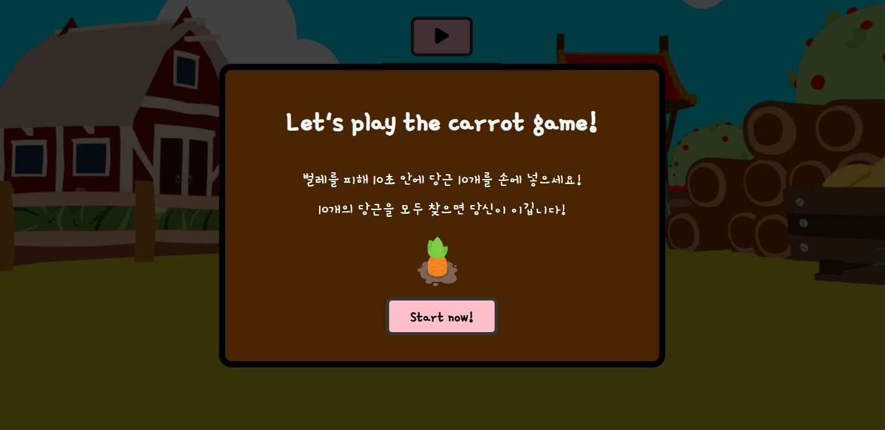
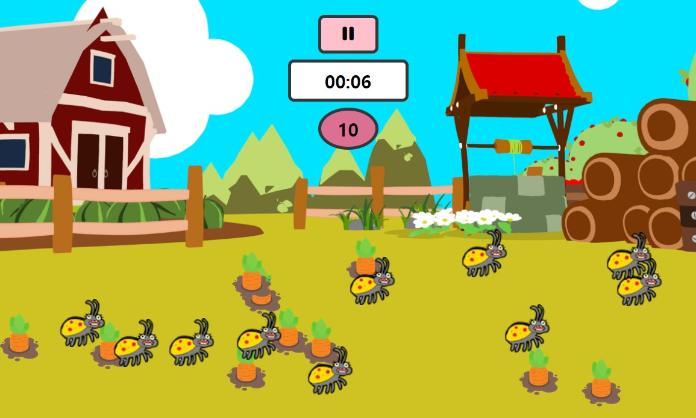

# 🥕carrot-game

당근 게임(혼자완성.ver)
10초 안에 벌레를 피해 당근을 모두 클릭해서 찾으면 이기는 게임.

Game start 화면

Game play 화면

# 🎡Diagram

게임 개발을 위한 전반적인 로직을 다이어그램으로 만들어 보았다.

# ⚙️Refactoring

#### **⚙️Refactoring 단계**

 
<b>1. 🛠️모듈화(Export, Import) : 파일을 작은 단위로 나누어 생성하고 모듈화 하고 객체지향적으로 코딩한다. Export, Import하여 외부로 노출시키고 가져와서 활용한다.</b>

- 모듈화의 장점 : 하나의 파일에 많은 코드를 작성하면 코드의 의미 파악, 관리, 재사용성이 떨어진다. 각각의 기능별로 파일을 분리하여 모듈화시키면 코드를 효율적으로 관리할 수 있으며 재사용성도 높아진다.

- HTML에서 큰 섹션 단위인 game과 popup섹션의 기능을 나누어 js파일 생성하고, 그 안에서 다시 작은 단위로 모듈화하여 객체지향적(Class)으로 함수를 활용한다.

 
<b>2. 🧩객제지향(Class) : 객체(Class)를 생성하여 함수들을 기능별로 나누어 사용한다.</b>

- 객체지향(Class)의 장점 : 단일성, 고립성, 독립성, 테스트성, 재사용성 등등

- game, popup, field 등 기능별로 파일로 나누고 각각의 객체(Class)를 생성한다. main.js에서 사용했던 함수들을 각자 파일의 기능에 맞게 나누어 객체(Class)안에서 멤버변수와 함수로 사용한다.

 
<b>3. 🔗빌더 패턴(Builder pattern) : 빌더 패턴을 이용하면 Object를 간단 명료하게, 가독성 좋게 만들 수 있다.</b>

- 빌더 패턴의 장점 : Object 생성 시 생성자에게 3개 이상의 인자를 전달할 경우, 어떤 위치에 어떤 타입의 값을 전달하는지 명확하게 제시할 수 있고 가독성도 좋다.

- GameBuilder Class를 생성하여 Export하고, GameBuilder가 Game Class를 리턴하여 GameBuilder를 통해 Game에 생성자를 전달하고, 접근할 수 있도록 하는 방식이다.

 
<b>4. ❄️객체 동결(Object.freeze()) : 문자열 인자를 전달할 때 문자열을 Object의 속성으로 동결(수정, 삭제, 변경 불가)시킨다.</b>

- 오브젝트의 속성값으로 접근할 수 있도록 하여 사용자의 실수나 오타의 가능성을 줄이고, 추후 값이 변경되는 것을 막을 수 있다.

- Reason Object를 생성하여 속성값으로서 'cancel', 'win', 'lose' 등을 인자로 전달하여 오타의 가능성을 줄인다.

 
<b>5. 🧹함수를 깨끗하게(Clean) : 중복코드를 줄이고 재사용성을 높인다.</b>

- main.js를 최소화 시켜 가독성이 좋고 코드의 의도를 파악하기 쉽게 정리한다.

# ✅ Takeaway 느낀점/개선할점

- 무조건 짧은 코드보다 가독성이 좋고 직관성이 높은 코드가 좋다.

- 코드의 가독성은 우선적으로 변수와 함수명에서 출발한다(함수명이 길더라도 직관적이고 가독성 좋게).

- 하나의 함수에 하나의 기능을 담당하도록 세분화 해야 할 필요성을 느꼈다.

- 함수에 인자를 전달하여 불필요한 코드의 중복을 줄이고 재사용성을 높이자.

- 모듈화의 시작점은 하나의 기능을 하는 세분화된 함수로부터 시작되는 것 같다.

- 객체지향적으로 코딩하는 것에 대한 연습이 필요하다

- 클래스의 함수를 다른 함수 등의 인자 등으로 전달할 때 Class정보는 전달되지 않는다.(함수를 Class와 바운딩 해줘야 한다. > this bounding 해야 한다.)

- this bounding을 제대로 하지 않고 넘어가면 this를(객체를) 참조할 수 없어(undefined) 연쇄적으로 예상하지 못한 다른 곳에서 연속적으로 error가 발생할 수 있다.

- document.style.display='none' > 가독성에 좋지 않다. 되도록 classList.add 등을 이용해 클래스로 스타일을 변경하도록 하자.

- 팝업 등은 하나의 함수에 인자를 전달하여 재사용할 수 있도록 하자.
